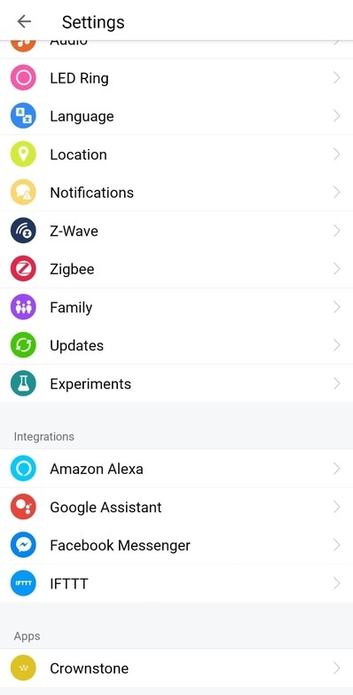
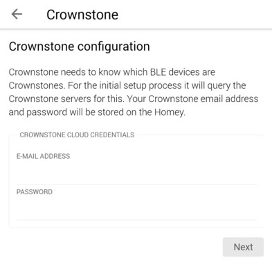
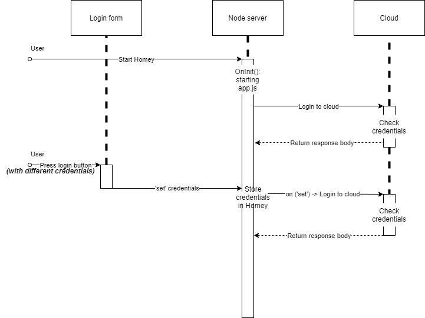
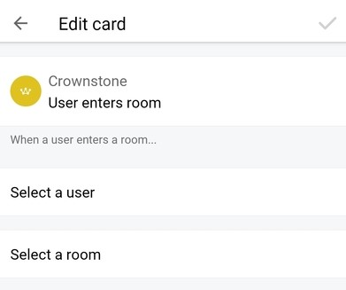
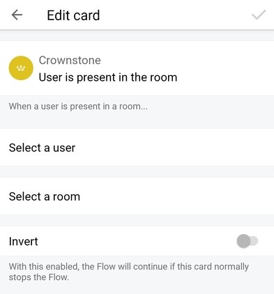

# Homey Crownstone App  

A Crownstone app to integrate with Homey. The Crownstone App refers to the app from Crownstone that runs on the Homey.

## Development

A Homey App is software that runs on Homey.
Apps are written in JavaScript, and run on Node.js in a sandboxed environment.

If you want to work on the app as a developer, there is a [Getting Started Manual](https://apps-sdk-v2.developer.athom.com/tutorial-Getting%20Started.html) at the documentation of Athom.
It will tell you the steps on how to install athom.

After installing athom, you can run the Crownstone App by getting the code and running it:
```
git clone https://github.com/crownstone/crownstone-homey
homey app run
```

To make sure that the app can make a connection with the Crownstone Cloud and Event Server, the crendetials of your Crownstone Account should be entered in the _Settings menu_.

_Go to the Settings menu._



_Click on the Crownstone icon at the bottom._



_Here the user can enter his credentials for his Crownstone Account._

### Logging
There is no way to check the logs of the app unless you run the app from your own terminal. From there you can see the logs and potential errors.

### Maintaining code

To publish a new version of the app, run `homey app publish` from the app directory.

Then, you are asked to choose if you want to change the version number or not.

By default the app will be submitted as _Draft_. You can then choose to release a test version of the app, which will only be available for users who visit the app via the test link which is available in the owner's dashboard.

Go to _https://developer.athom.com/_ > _Apps SDK_ > _My Apps_ and from there
you can choose to submit the app to Test, or Live by submitting it for certification. The app will be published after it is approved by a reviewer at Athom.

A more detailed explanation is provided in the [Documentation](https://apps-sdk-v2.developer.athom.com/tutorial-App%20Development%20Guidelines.html) from Athom.

When working on and updating code, there are some things to consider.

When publishing a new version of the app a `.homeychangelog.json` file is automatically created in the root directory of your app and `homey` will ask you to add an entry to this changelog.
The changelog will be displayed under the app description in the Homey Apps Store.

There are a few situations in which the app breaks functionality for current users when changed. Those situations are:
- Removing or adding driver capabilities
- Changing or removing Flow cards
- Changing a driver's device class

In the [Documentation](https://apps-sdk-v2.developer.athom.com/tutorial-App%20Development%20Guidelines.html) of Athom, the development guidelines are explained and it tells you what to do when updating code functionality as shown above. 

## Dependencies

The Crownstone App is depending on 3 libraries:
- homey
- crownstone-cloud
- crownstone-sse

The dependencies don't update automatically as of now.

## The process - Cloud

### App Manifest
Before working on the application in Homey, it is important to know how a Homey app works. A good way to see that is to look at the file structure of the app. If the file structure of the app is easy to understand, it is much easier to find what you need.
On the [Homey Developer website tutorial](https://apps-sdk-v2.developer.athom.com/tutorial-App%20Manifest.html), an example of the file structure is shown.
The most important parts of the file are __app.js__, which is the starting point for the app, __app.json__, which contains all metadata for the app, __drivers__, which contains all the data for the drivers (in this case for Crownstone) and __settings__, which makes it possible for users to use their credentials to make a connection to the cloud. All of these files will be explained in more detail later on.

### App

#### Initiation
The app.js file is the starting point of the application. As soon as the Homey starts, the `OnInit()` method is called.
The first thing that will happen is getting the credentials (only the username and password are needed) for the Crownstone Cloud from the user which can be obtained from Homey.ManagerSettings, where the credentials are saved. These credentials will later be used to make a connection with the Crownstone Cloud and the Crownstone Event Server. This was done in the settings which will be explained in more detail in the section _App Settings_.
The credentials can be obtained using the method `ManagerSettings.get()` and can be saved in a variable like this:
```
this.email = Homey.ManagerSettings.get('email');
this.password = Homey.ManagerSettings.get('password');
```

#### Setting up the connections
The next step is to make all the necessary connections. This is done using the `setupConnections(email, password)` function. The arguments of the function are the _email-address_ and the _password_ for the user's Crownstone account. This function calls multiple functions which are explained below.

##### Crownstone Cloud
First, a connection to the Crownstone Cloud will be made using the _Crownstone Cloud library_:
```
const cloudLib = require('crownstone-cloud');
const cloud = new cloudLib.CrownstoneCloud();
```
Then, this method is used to make a connection to the Crownstone Cloud:

`cloud.login(email, password)`

##### getPresentPeople
After that, all the users and their current locations in the sphere should be obtained from the cloud. The data will be used later for the Flows.
The first thing the `getPresentPeople()` function will do is obtain the current sphere ID using the `getSphereId()` function.
If the user is not present in the sphere or has his location turned off, the sphere ID will be _undefined_ and the list of user locations will stay empty.
If the sphere ID is defined, the data will be obtained from the Crownstone Cloud and saved in the local variable _userLocations_ using:

`await cloud.sphere(sphereId).presentPeople();`

After this, the data of the users and their locations will be updated using the events from the Event Server. The `getPresentPeople()` function will be used in case of missed events.

##### Event Server
The Event Server is used to receive events like 'a user who enters or leaves a certain room'. These events are used for the Flows.
The _Crownstone SSE Library_ is used to make a connection with the event server:
```
const sseLib = require('crownstone-sse');
const sse = new sseLib.CrownstoneSSE();
```
To log in to the event server, the function `loginToEventServer(email, password)` is used with the _email-address_ and the _password_ for the user's Crownstone account as parameters.
First, all possible running eventHandlers get stopped, in case a new connection has been made using `sse.stop();`.
Then a new connection with the event server is made using the _email-address_ and _password_ using the method `sse.login(email, password);`.
And then the eventHandler will be started using `sse.start(eventHandler);`. More information on how the eventHandler is used will be provided in the section of _Flows_.

##### Obtain user locations
After that the function `obtainUserLocations()` is called, this function will call the `getPresentPeople()` function every 30 minutes in case of missed events.

#### Eventlistener
Every time a user changes the credentials in the settings, a new connection should be established with the cloud in case the user entered the wrong credentials before or changed his password for the cloud. In order to notice that the credentials have been changed, an event listener is added which will fire when a setting - such as a username or a password - has been 'set':

`Homey.ManagerSettings.on('set', function(){}`

When it fires, the newly-stored credentials will be obtained from the Homey and the `setupConnections(email, password)` function is called which will establish a new connection to the cloud.
This process is described in the sequence diagram below:


### Driver
When making the Homey App for Crownstone, a driver is needed to add support for devices like the Crownstone plug. The driver manages the addition and working of the devices. There is only one Driver instance and as many Device instances as there are devices added to the Homey as seen on the image on [the Homey Development Tutorial on Drivers](https://apps-sdk-v2.developer.athom.com/tutorial-Drivers.html).

#### Driver

##### Adding devices
When a user is adding a device and the '_list\_devices_' view is called, the method `onPairListDevices(data, callback){}` is called. This method will call the `getLocation()` function which is defined in the app. That function will return the cloud-instance and the sphere ID.
Then the `getDevices(cloud, sphereId)` function is called which uses the instance of the cloud and the sphere ID to obtain all the devices in the current sphere using:

`await cloud.sphere(sphereId).crownstones();`

Then, the function `listDevices(deviceList)` is called which will create empty _device_ objects and adding the properties of the devices obtain with the cloud to it:
```
let device =  {
    'name': crownstoneList[i].name,
    'data': {
        'id': crownstoneList[i].id,
    }
}
```
After that a list in this format of all the devices in the sphere is returned and will be shown to the user.
A device can be deleted using the Homey App, and it will automatically be removed from the list. Any Flows that were interacting with that device won't work anymore.
It is important to keep in mind that the properties added to the object must be static, because the Homey identifies different devices using the object, instead of the id only.

#### Device

##### Initiation
When the device is initialized, it will obtain the cloud instance from the CrownstoneApp using:

`this.cloud = Homey.app.getCloud();`

After that, a capability listener will be registered to listen for device state changes:
```
this.registerCapabilityListener('onoff', this.onCapabilityOnoff.bind(this));
```

##### switch state
If a state change is requested for a device a request will be sent to the cloud. 
If the device is requested to turn on:

`await this.cloud.crownstone(this.getData().id).turnOn()`

And if the device requested to turn off:

`await this.cloud.crownstone(this.getData().id).turnOff()`

### Internationalization
Internationalization doesn't look that important in the beginning process of development, but later on, it's getting more important, especially if the application will be accessible for users around the world. That's why the implementation of internationalization early on in the development is important since it only gets more difficult to implement internationalization later on in the development of an application.
All the different translations that are supported in the app will be included in the _/locales/_-folder (_see App Manifest_). The translation strings are stored in a _.json-file_ with the language code as their name.
For example: _nl.json_ and _en.json_.

## The process - Flows
User can create Flows for their Homey in the Flow Editor using different cards. There are three types of cards: when, and, then.
The when.. cards are called triggers. 
The ..and.. cards are called conditions.
The ..then cards are called actions.
For the Crownstone App, only the trigger and condition card are used.

### Trigger card
The trigger card will fire when a new event has occurred. In this case, when a specific user enters a specific room, which will run all of the user's flows that use this trigger.
The trigger is: "_When [user] enters [room]_", with _[user]_ and _[room]_ the variables selected by the user.



### Condition card
The condition must be true, for the flow to continue. In this case, a check will be done to see if a specific user is or isn't in a specific room.\newline
The condition is: "_When [user] {is|isn't} present in [room]_", with _[user]_ and _[room]_ the variables selected by the user and _{is}_ the normal state and _{isn't}_ the inverted state.
If the condition state is inverted, the condition must be _false_, for the flow to continue.



### Users and Rooms
For both the trigger- and condition-card, the user can choose a specific user or room in the sphere for the card. When a user selects the specific user or room, an array with options appear. This is done by using the autocomplete-argument. The array with options is obtained using the code in the app.

#### Users
To obtain the users in the current sphere, the `getUsers()` function is called. This function first obtains the sphere ID of the current sphere and will then obtain a list with all the users and their information in the sphere using:

`const users = await cloud.sphere(sphereId).users();`

Then, the function `listUsers(users)` which will return a list with only the username and ID is called. The first thing this function does is create a default user-object named _'Somebody'_ with _'default'_ as ID. This value can be used if a trigger or conditions applies for _every_ user in the room. For example: When _somebody_ enters a room..
After that the function will call the `addUserToList(userList, users)` function three times, since the original user list is divided in three sections: _admins_, _members_ and _guests_. The argument _userlist_ is the list that will be returned from this function and the argument _users_ is the list with _admins_, _members_ or _guests_. The `addUserToList(userList, users)` function will create a new user-object and will set the user's first- and last name as the name and set the user's ID to be the ID like this:
```
const user = {
    name: users[i].firstName + ' ' + users[i].lastName,
    id: users[i].id,
};
```
This will be pushed to the list that will be returned by the `listUsers(users)` function.
If no users are found, the length of the list will be one, since the default user _'Somebody'_ is always defined. So if the length of the user list is not greater than one, an empty list will be returned.

#### Rooms
The way to obtain the rooms is almost the same as that of the users. First, the `getRooms()` function will be called, which will obtain the sphere ID of the current sphere and will then obtain a list with all the rooms and their information in the sphere using:

`const rooms = await cloud.sphere(sphereId).locations();`

When the rooms are obtained, the function `listRooms(rooms)` with the list of rooms as parameter will be called to create a list of the rooms that will be shown to the user. A new room-object will be created for every room and the room's name will be set as the name, and it's ID will be set as the ID like this:
```
const room = {
    name: rooms[i].name,
    id: rooms[i].id,
};
```
If there are no rooms found, an empty list will be returned.

### Event-Handler
The Event-Handler will receive events when a user enters or leaves a room. When an event has been received, the function `runTrigger(data, entersRoom)` will be called, with the parameter _data_ as the data received in the event and the parameter _entersRoom_ as a boolean which is _true_ if a user enters a room, and is _false_ if a user leaves a room.

#### Update userlocation list
The users and their location is saved in the local variable _userLocations_ which will prevent the need for having to query the users and their locations from the cloud every time an event occurs. This will give the triggers a faster response time and will also make it easier to debug.
In case of missed events, the `getPresentPeople()` function will be called using the cloud to replace the values with the actual representation of the users and their locations.
For every new event, the local variable needs to be updated which is done by using the function `updateUserLocationList(entersRoom, userId, location)` with _entersRoom_ as a boolean that determines if a user enters or leaves a room, the _userId_ as the user ID, and the _location_ as the location the user just entered or left.
First, the function `checkUserId(userId)` will check if the user is already defined in the list and return the index. If the user just entered a room, there will be checked if the user is already in the list or not. If the user is not yet in the list, an object of the user with it's location will be added to the list. If the user is already in the list, there will be a check first if the location in the list is the same as the location of the user. In that case, an event probably has been missed, and the `getPresentPeople()` function will be called to reset the variable.
If the location in the list is not the same as the new location, that location will be updated with the new location.
If _entersRoom_ is _false_, and the user just left a room, there will be a check if the user is in the list. If the user is in the list and the location is the same as the location the user just left, an event probably has been missed, and the `getPresentPeople()` function will be called to reset the variable. Otherwise, the list is already up-to-date and the function will end.

#### Triggers
After the list has been updated in the `runTrigger()` function, and the event is a user _entering_ a room, the _{presenceTrigger_ will be fired with the current state as argument. The state is an object which contains the user ID and the location ID.

##### Trigger
For the Trigger in the _registerRunListener_, the flow will run if the location ID and user ID in the state are equal to the room ID and the user ID in the arguments of the Trigger-card, or the location ID in the state and the room ID in the argument is equal and the user ID is equal to _'default'_, the flow will run:
```
Promise.resolve(args.rooms.id === state.locationId 
    && args.users.id === state.userId 
    || args.users.id === 'default')
```
##### Condition
If the return value of the Trigger was _true_, and a condition-card is defined, a check for the condition in the _registerRunListener_ will be made.
First, the code checks if the user ID argument is _'default'_, if that is the case, the function `checkRoomId(roomId)` will be called to check if the room ID exists in the list of userLocations so that if _'Somebody'_ is in that specific room, the flow will run. The function returns _true_ if the room exists in the list and _false_ if it doesn't.
If the user ID is specified, the function `checkUserId(userId)` will be called to check if the user is already defined in the list. If the user doesn't exist in the list, the code will return _false_, but if the user exists in the list, it will check if the room ID argument is equal to the current location of that user which will return _true_ or _false_:
```
return Promise.resolve(args.rooms.id === userLocations[userInList].locations[0]);
```
