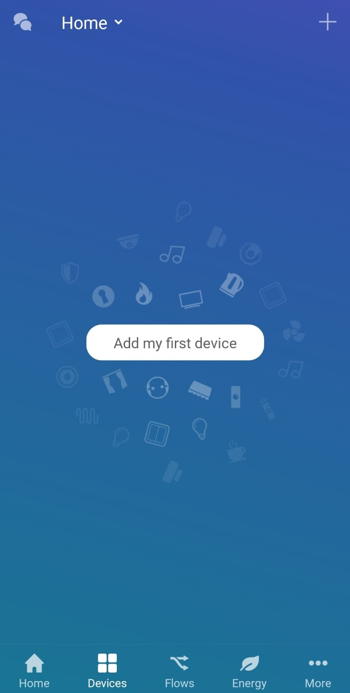
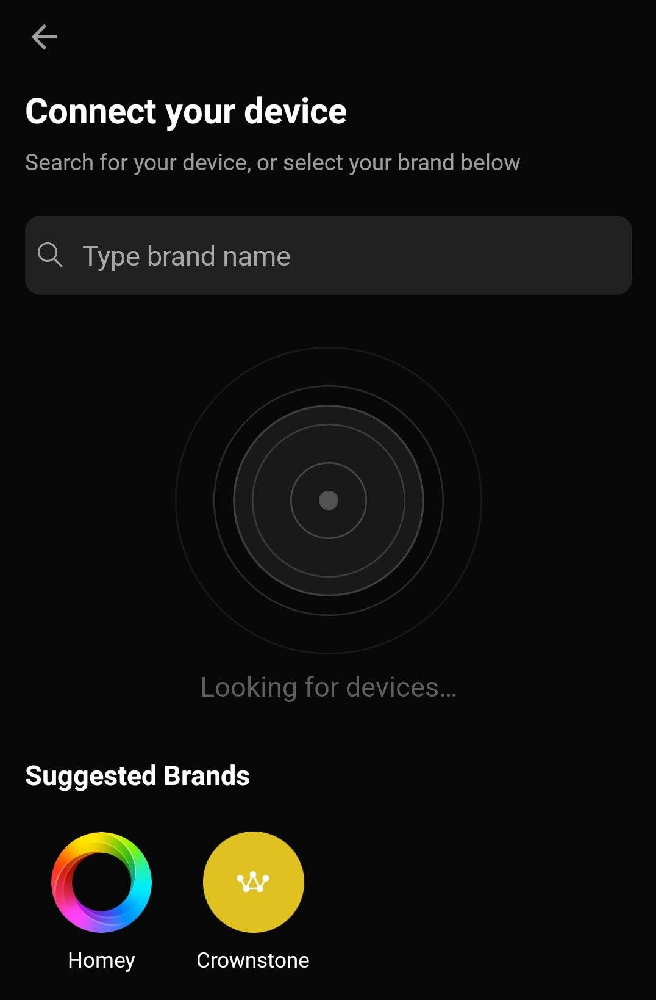
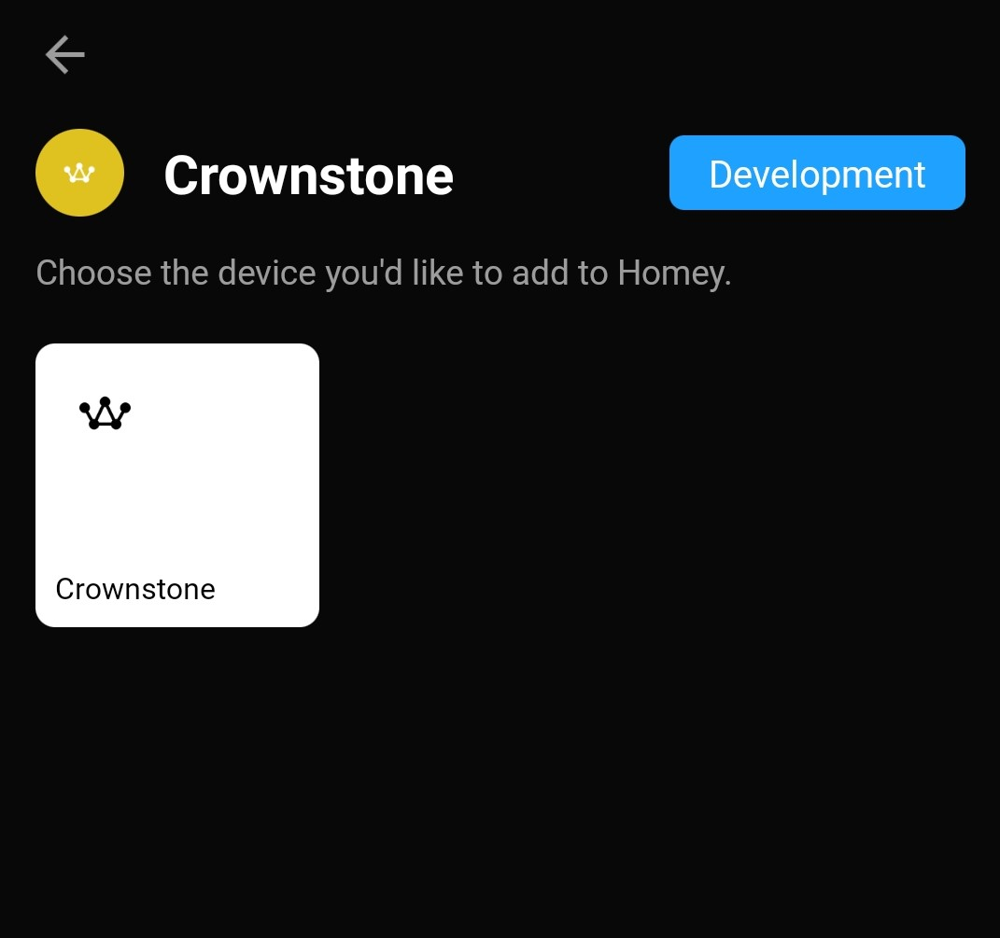
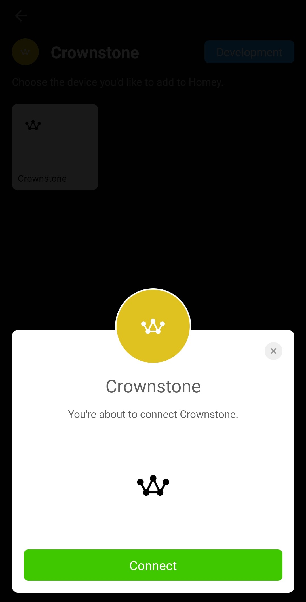
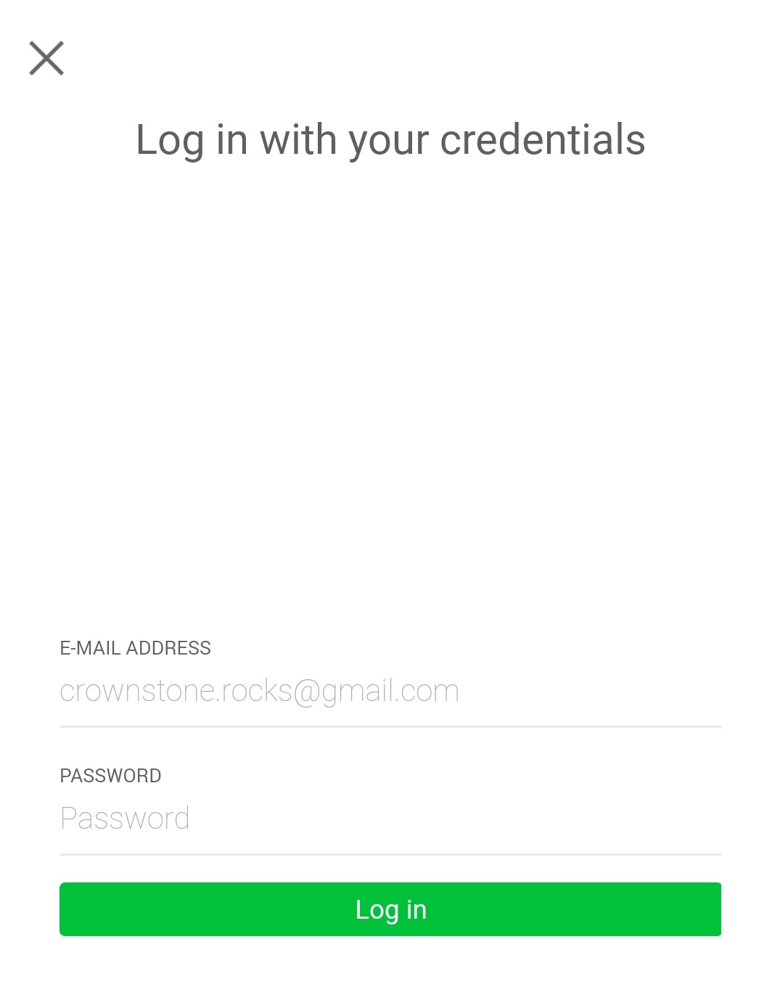
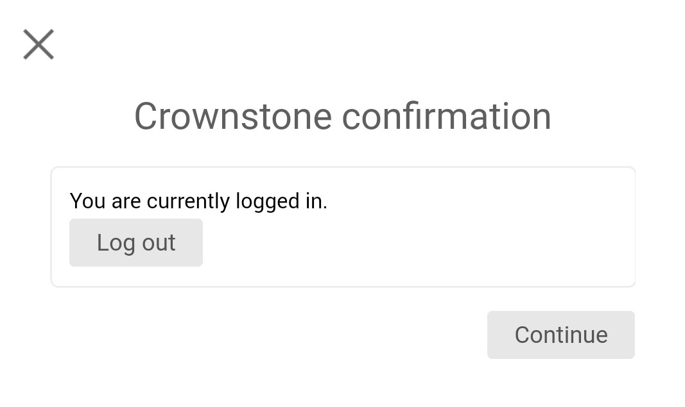
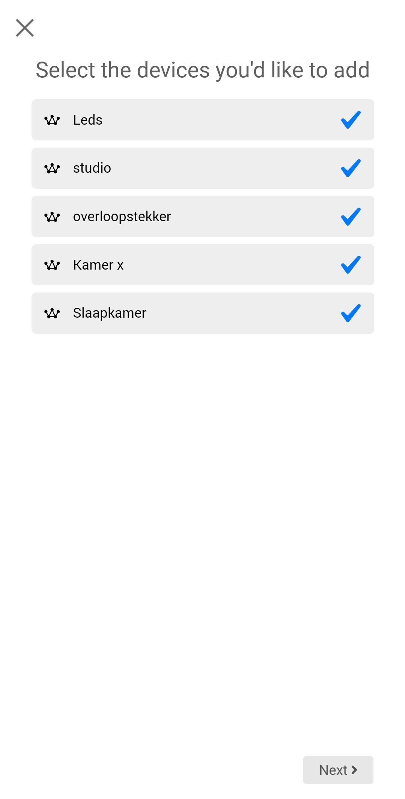
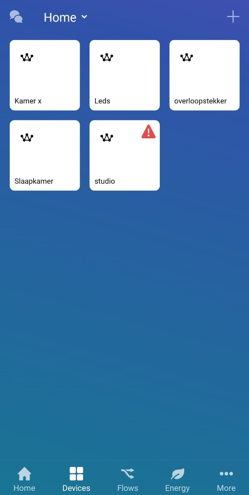
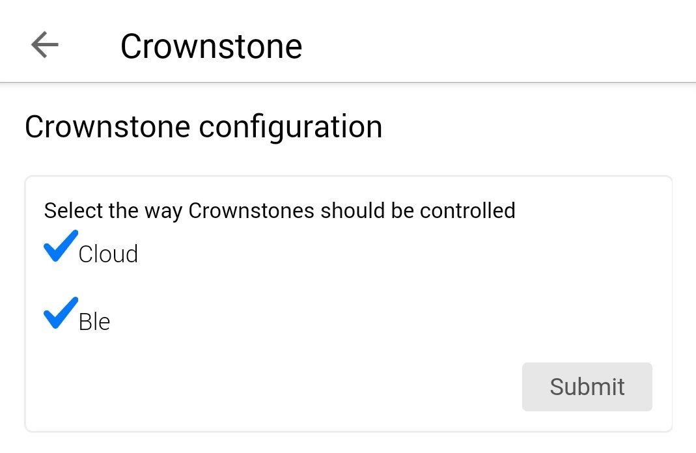

# Homey Crownstone App

A Crownstone app to integrate with the Homey smart home hub.

Here you can find the step-by-step tutorial to get started with the app.

## Home

The Homey does not have a concept of multiple homes. This is quite logical, because it is likely to be placed in one
physical location. Crownstones however are a network of devices that you can install in your own home, but also in
your garage, your holiday home, at your grandmother's, etc. Each home contains a **sphere** of Crownstones.

When installing the Crownstone app on the Homey, this app will query the Crownstone servers for your current location.
The discovery process will only return the Crownstones from this particular location. You will not be able to see
Crownstones from other locations. Make sure to activate the Crownstone App and enable location to obtain the Crownstones.

This makes physical sense, the Bluetooth connections from the Homey only reach the Crownstones in its vicinity.

## Adding devices

When the app is installed, and you want to add devices, go to the devices page.

Click on the `+` in the top right corner or on the `Add my first device` text in the middle.

Then, select `Crownstone`.

Crownstone only has 1 device to add, so select the `Crownstone` device.

Then, press `Connect` to start the pairing process.

When adding devices for the first time, you'll be asked to log in to your Crownstone Account so the Crownstones can be obtained.

Enter your credentials and press `Log in` to continue adding devices.

If you're logged in, you will see the following screen.

In this screen, you can choose to `continue` with your current account, or `log out` and log in with a new account after.

If you press `Log out` you will return to the login screen.

If you press `Continue` you will be redirected to the screen where you can add your Crownstones.

In this screen you can select the devices you want to add and press `Next` to add them to your Homey.

## Using devices

When your devices are added, you should see something like this.

In this sphere, the device called `studio` is locked, which is marked with a red triangle. You are unable to control the device from the Homey.

You can switch your devices on and off by pressing the devices.

There is also the ability to dim the Crownstones, when the dimming capability is also enabled in the Crownstone App.

To dim a device, press the device and hold it until a dimming menu shows up.

## Settings

You can select if the Crownstone should be switched using the Crownstone Cloud or using Ble.

To do this, go to the `Settings`.

Then, press the `Crownstone` text to go to the Crownstone settings menu.

In this menu, you can mark the ways how Crownstones should be controlled.

At least one option needs to be checked.

The options are both selected by default.