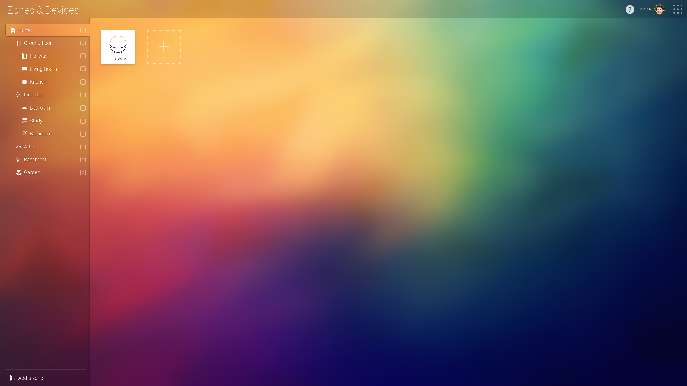
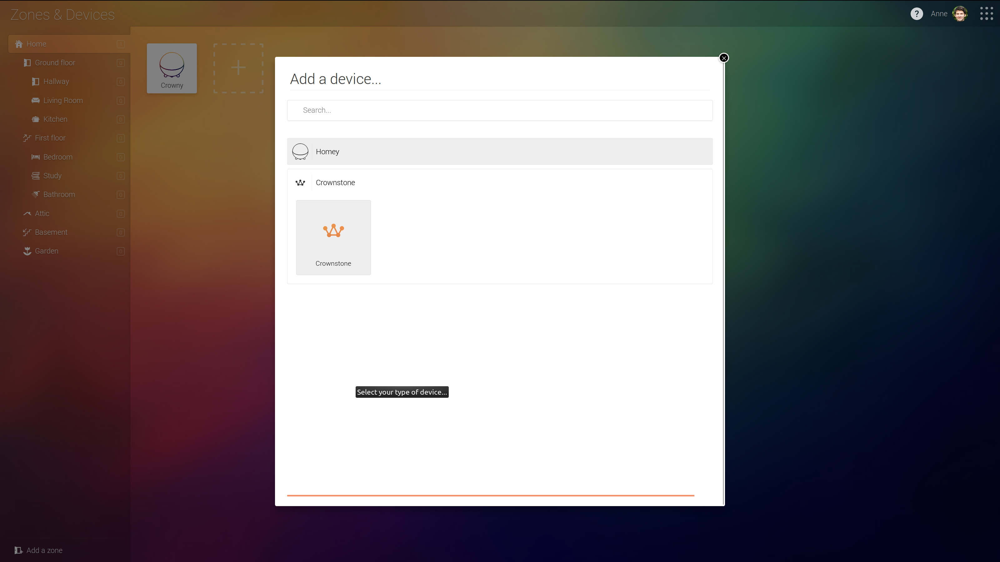
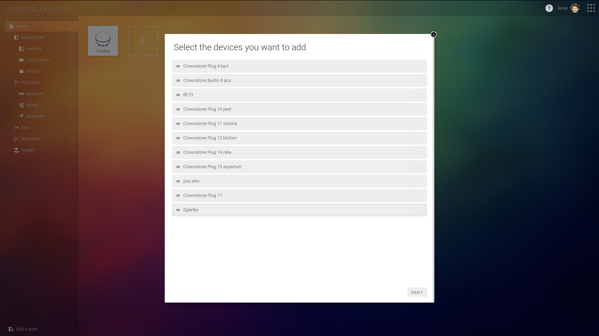
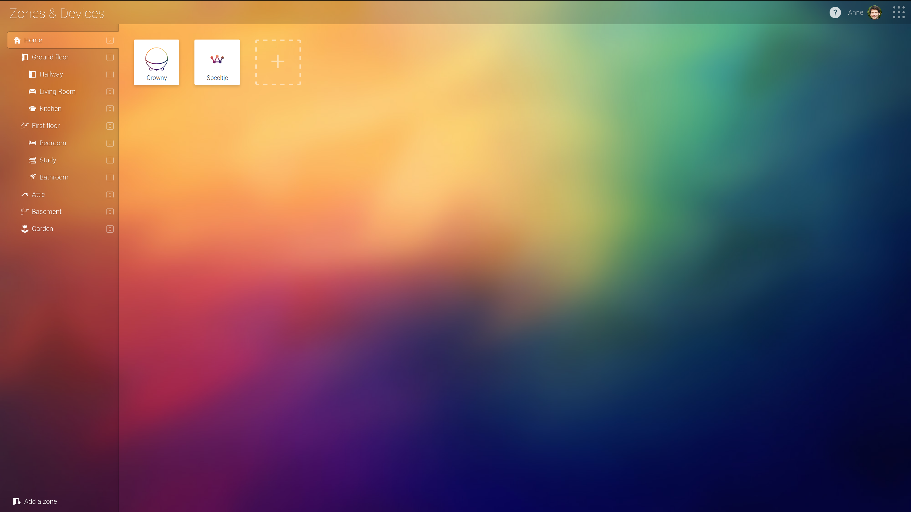
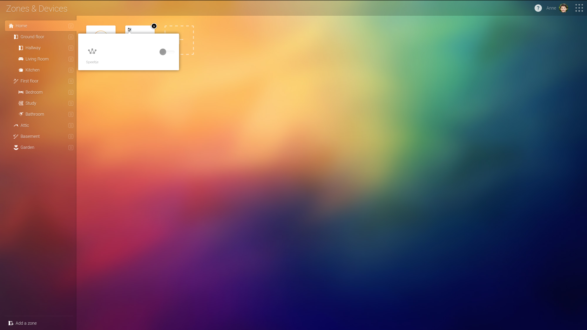
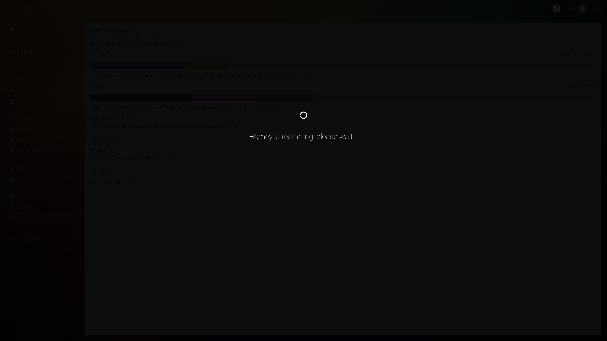

# crownstone-homey

Integration with Homey

First, find the `HOMEY_IP` address. Use e.g. `sudo arp-scan -l` and search for a device with manufacturer name
`Azurewave Technologies, Inc.`.

Navigate to <http://$HOMEY_IP/manager/settings/#homey:manager:apps> to operate the graphical user interface that
is run from your Homey device.

At the Athom [documentation](https://developer.athom.com/docs/apps/tutorial-Getting%20Started.html) you have a
getting started manual. It tells you to install the `athom` utility through npm. It is similar in operation to for
example the `heroku` utility. After setting up keys etc. as indicated over there, go to the root directory of 
this repository:

    athom app run

In the GUI a Crownstone application appears.


If you click at the `Crownstone` text at the bottom left, you see a new dialog appear:


## sphere id

The `sphere id` that will be used behind the scenes is the one where the user is located. This is obtained automatically via the [Crownstone cloud API](https://cloud.crownstone.rocks). 


After running you will see something like:

```
┌────────────────────────────────────────────┐
│ Hey developer, we're hiring! View our open │
│ positions at https://go.athom.com/jobs     │
└────────────────────────────────────────────┘
✓ Validating app...
✓ Homey App validated successfully against level `debug`
✓ Packing Homey App...
✓ Installing Homey App on `Crowny` (http://10.27.8.182:80)...
✓ Homey App `rocks.crownstone` successfully installed
✓ Running `rocks.crownstone`, press CTRL+C to quit
─────────────── Logging stdout & stderr ───────────────
2018-07-24 14:50:40 [log] [MyApp] Crownstone!
2018-07-24 14:50:40 [log] [MyApp] rocks.crownstone is running...
2018-07-24 14:50:40 [log] [MyApp] Load bluenet library
2018-07-24 14:50:40 [log] [MyApp] Setup Homey
2018-07-24 14:50:40 [log] [ManagerDrivers] [crownstone] Init Crownstone driver
2018-07-24 14:50:41 [log] [MyApp] Successfully connected to the Crownstone cloud
2018-07-24 14:50:41 [log] [MyApp] Get stones in sphere
2018-07-24 14:50:42 [log] [MyApp] Start Scanning
2018-07-24 14:50:48 [log] [MyApp] Scan completed, parsing results...
2018-07-24 14:50:48 [log] [MyApp] No Crownstones found in scan...
```

We are hiring as well. :-)

# The process

## Sphere

The sphere is automatically obtained from the first smartphone device that is found in the Crownstone cloud. That device is situated in a particular home (sphere). The keys that belong to that sphere will be used to encrypt/decrypt messages towards the Crownstones from the Homey hub.

## Add Crownstones

It is necessary to add a Crownstone manually. Although the Crownstone code supports automatic discovery, in the setup at Homey the user manually selects a Crownstone from the list






## Control Crownstone

It is fairly simple to control the Crownstone.



Of course you can also say something like: "Okay Homey, turn on coffee machine" or in Dutch "Oke Homey, zet het koffieapparaat aan".

## On problems

There is almost nothing for you to check if the Crownstone app works. There is no logging etc. If you want to see logging, you have to install this app from github and run it from the command line with `homey app run`.

Bluetooth problems are at times resolved by restarting the Homey (from the System menu):



## Console

Switching a Crownstone on the console with `athom app run` will show something like this:

```
✓ Running `rocks.crownstone`, press CTRL+C to quit
─────────────── Logging stdout & stderr ───────────────
2018-07-24 15:42:46 [log] [MyApp] Crownstone!
2018-07-24 15:42:46 [log] [MyApp] rocks.crownstone is running...
2018-07-24 15:42:46 [log] [MyApp] Load bluenet library
2018-07-24 15:42:46 [log] [MyApp] Use sphereId: XXXXXXXXXXXXXXXXXXXXXX
2018-07-24 15:42:46 [log] [MyApp] Setup Homey
2018-07-24 15:42:46 [log] [ManagerDrivers] [crownstone] Init Crownstone driver
2018-07-24 15:42:47 [log] [MyApp] Successfully connected to the Crownstone cloud
2018-07-24 15:42:47 [log] [MyApp] Get stones in sphere
2018-07-24 15:42:48 [log] [MyApp] Start Scanning
2018-07-24 15:42:53 [log] [MyApp] Scan completed, parsing results...
2018-07-24 15:42:53 [log] [MyApp] Discovered Crownstones with the following Ids: [ '4', '10', '11', '13' ]
2018-07-24 15:42:53 [log] [MyApp] Doing the thing with the first Crownstone we discovered:  4  with the address: e9:5f:db:b9:af:f1
2018-07-24 15:42:53 [log] [MyApp] Doing the thing! Connecting...
Connected successfully!
Getting Services...
Getting Characteristics...
Connection process complete.
Getting Session Nonce...
Got Nonce!
Decrypted Nonce <Buffer a3 0d f5 60 ee>
Set Nonce
Session Nonce Processed.
2018-07-24 15:42:58 [log] [MyApp] Write switch state 0
2018-07-24 15:42:58 [log] [MyApp] Waiting...
2018-07-24 15:42:59 [log] [MyApp] Write switch state 1
2018-07-24 15:42:59 [log] [MyApp] Waiting...
2018-07-24 15:43:00 [log] [MyApp] Write switch state 0
2018-07-24 15:43:00 [log] [MyApp] Waiting...
2018-07-24 15:43:02 [log] [MyApp] Write switch state 1
2018-07-24 15:43:02 [log] [MyApp] Waiting...
2018-07-24 15:43:03 [log] [MyApp] Write switch state 0
2018-07-24 15:43:03 [log] [MyApp] Disconnecting...
2018-07-24 15:43:14 [log] [MyApp] Done!
```


