# Homey Crownstone App

A Crownstone app to integrate with the Homey smart home hub.

Here you can find the step-by-step tutorial to get started with the app.

## Home

The Homey does not have a concept of multiple homes. This is quite logical, because it is likely to be placed in one
physical location. Crownstones however are a network of devices that you can install in your own home, but also in
your garage, your holiday home, at your grandmother's, etc. Each home contains a **sphere** of Crownstones.

When installing the Crownstone app on the Homey, this app will query the Crownstone servers for your current location.
The discovery process will only return the Crownstones from this particular location. You will not be able to see
Crownstones from other locations. Make sure to activate the Crownstone App and enable location to obtain the Crownstones.

This makes physical sense, the Bluetooth connections from the Homey only reach the Crownstones in its vicinity.

## Homey app

You need the Homey app to install the Crownstone software from the Homey app store.

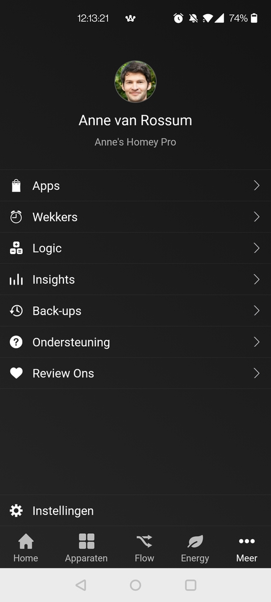

You can install the app like you normally would do for other apps on the Homey as well. Go to "Apps" and click the "+" sign at the top right corner. In the end you will have the app installed.

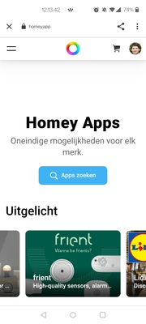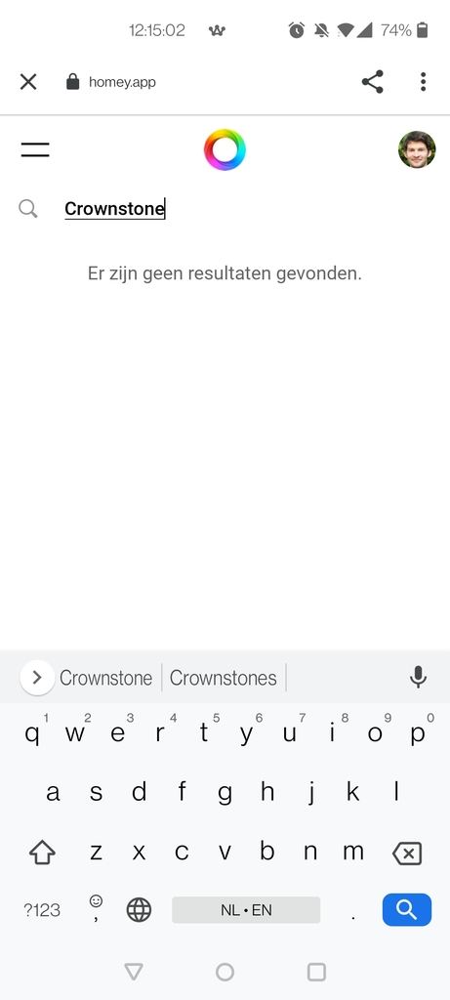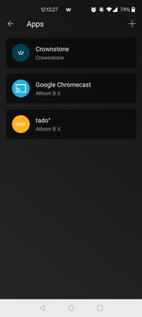

There is no need to configure the app, press the top left arrow to go back to the menu if you see the below screen.

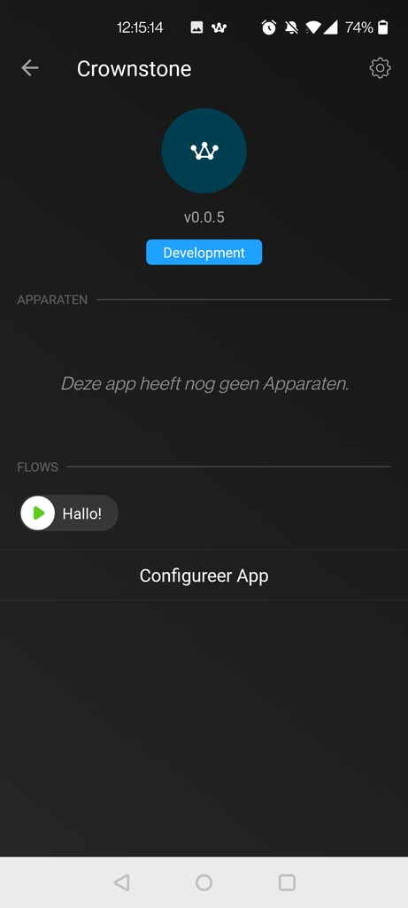

## Adding devices

For adding devices you click the second icon at the bottom.

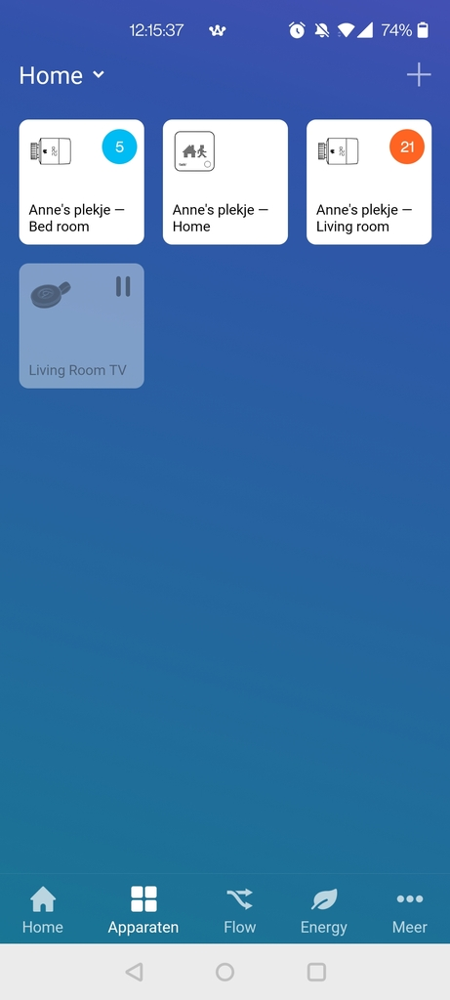

Now click on the `+` in the top right corner or on the `Add my first device` text in the middle (if it is your first device). You will have to select Crownstone and click through a few times.

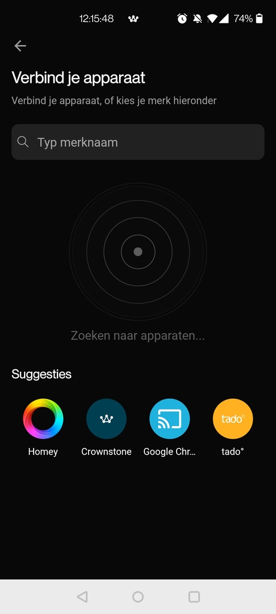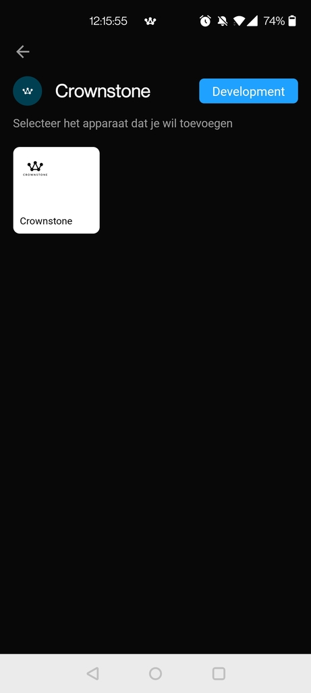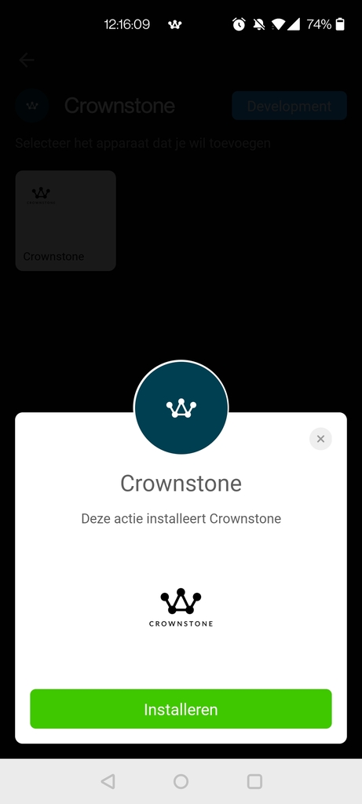

When adding devices for the first time, you'll be asked to log in to your Crownstone account. It will retrieve information about your Crownstone devices from the cloud.

Enter your credentials and select the Crownstone devices you want to add.

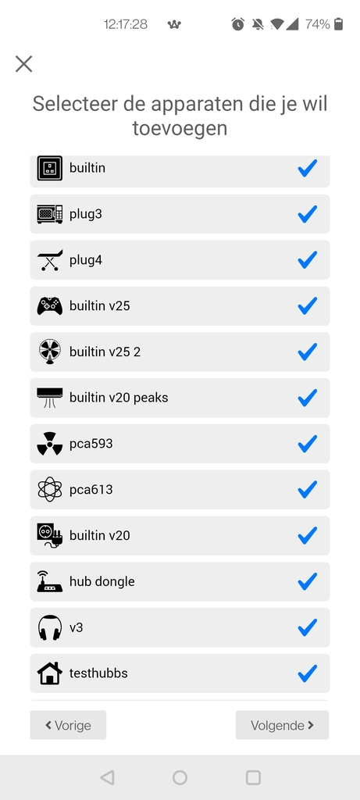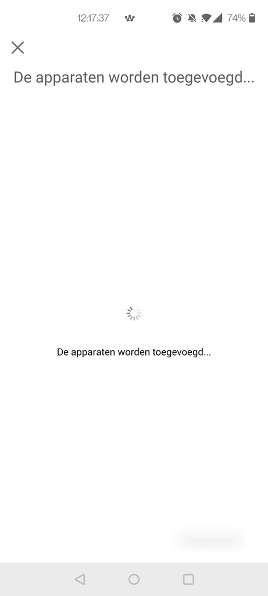

Now you will have a list of devices, all in the `Home` zone:

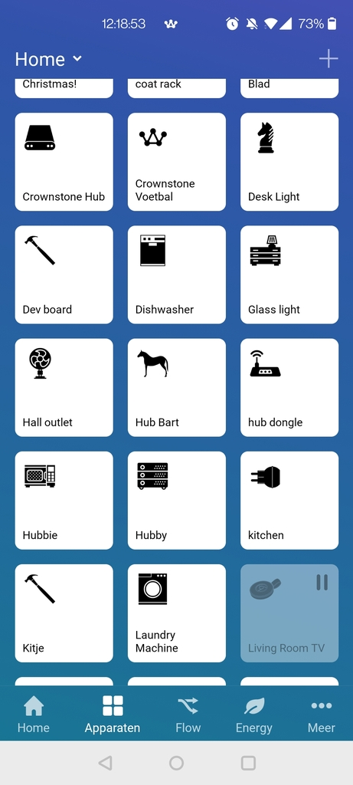

## Using devices

If you click a device you directly control it. You can also long-press an icon, for example to dim it.

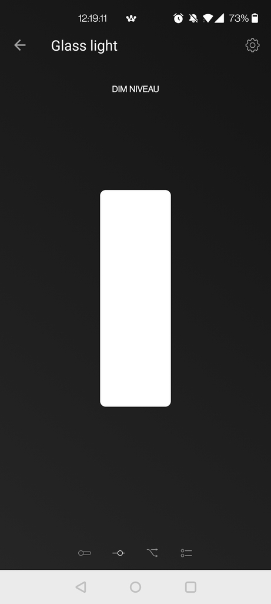

There are a few settings you can change per device. For example the `zone` and what's plugged in to it.

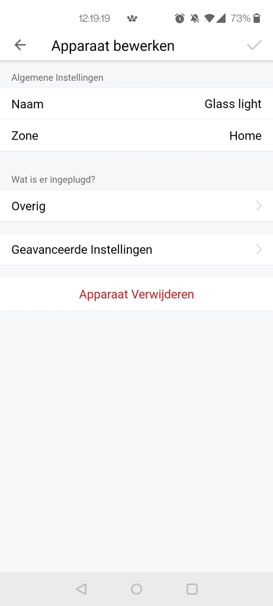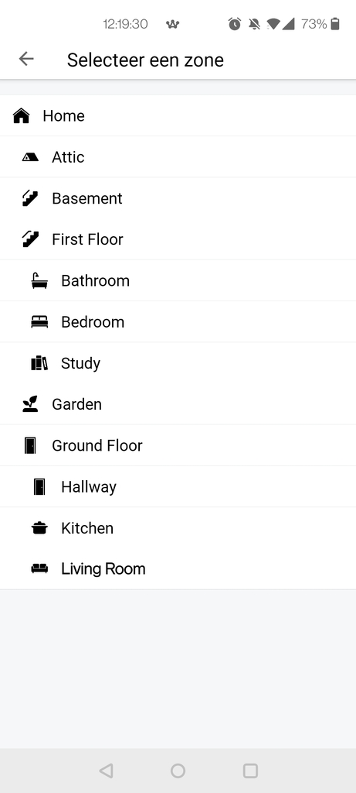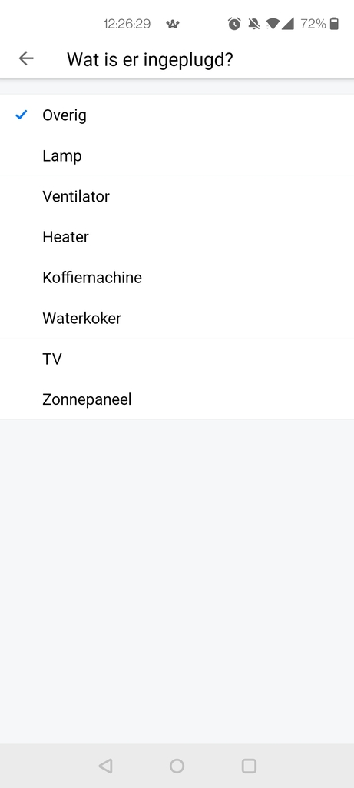

Crownstone can be **locked**. Those Crownstone cannot be controlled from the Homey. If you want to control such a Crownstone you will see a message like this.

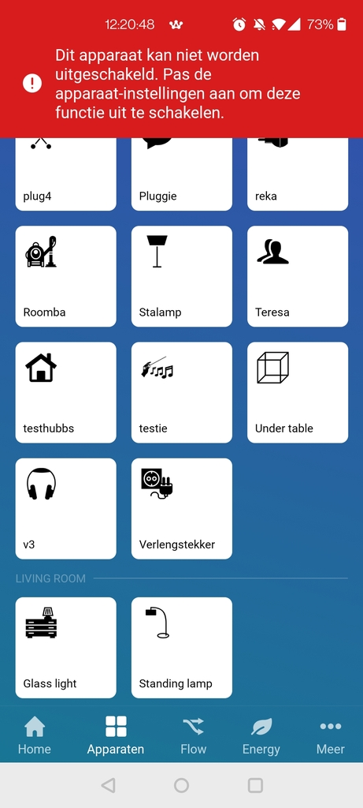

The result can be compared with the Crownstone app:

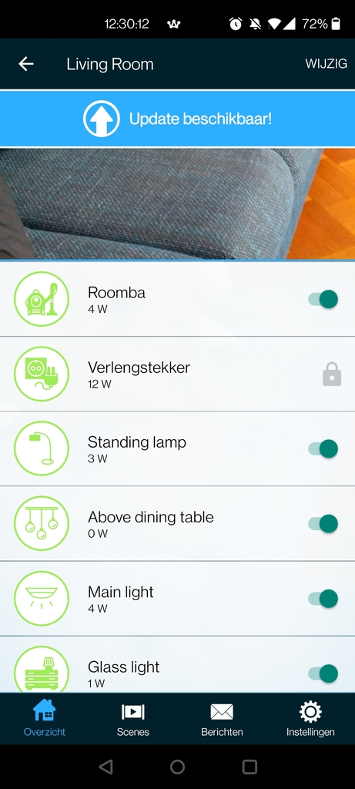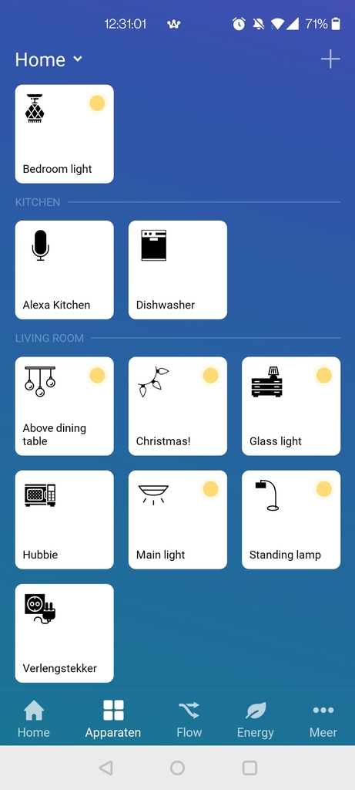

## Flows

You can also create flows within the Homey. This works like follows.

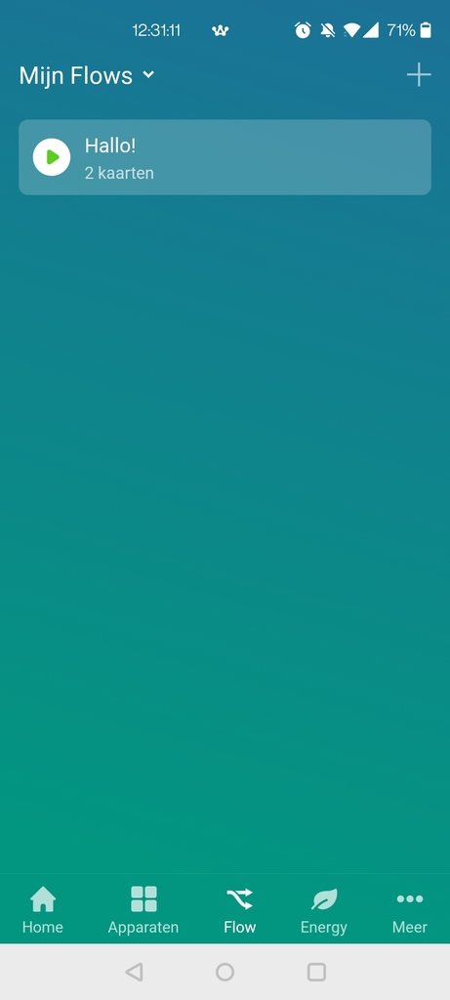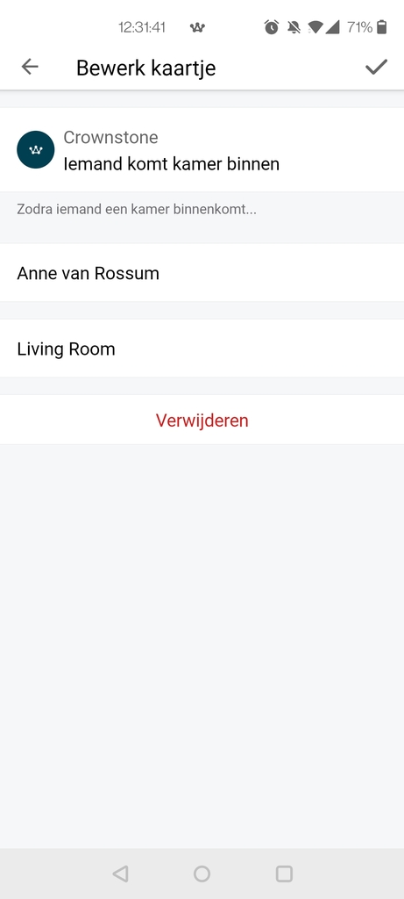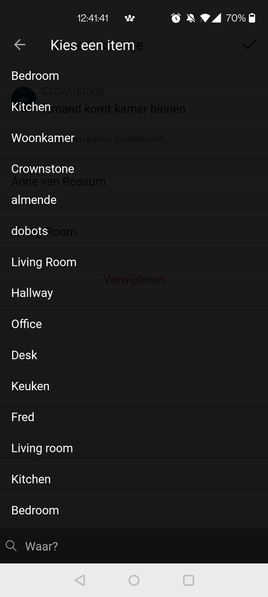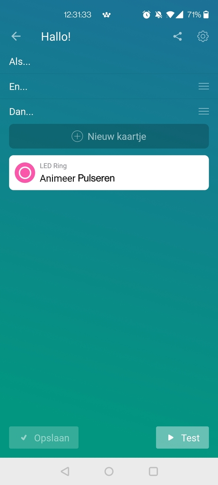

Using flows you can have all kind of actions coupled to events such as that someone enters a room or leaves the house.

## Developer settings

You can select if the Crownstone should be switched using the Crownstone cloud or using Bluetooth LE. The latter is an experimental setting and should not be used yet. By default only the cloud is used.
