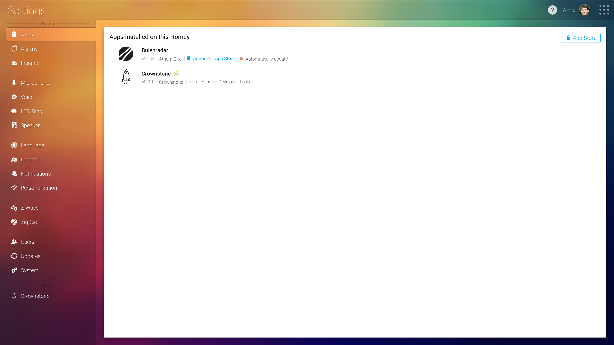
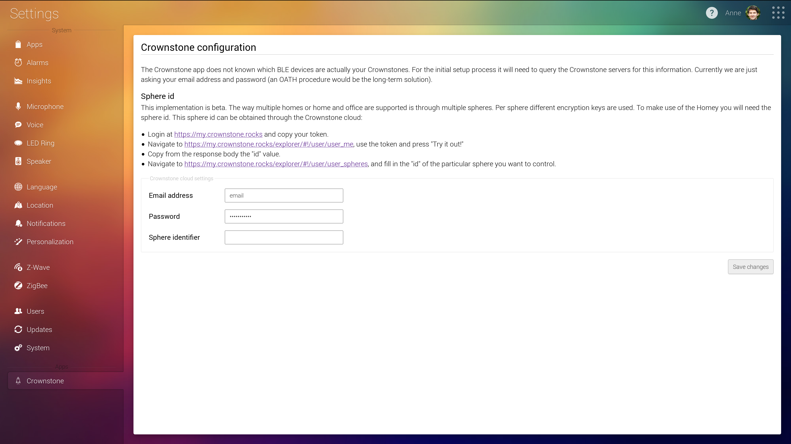

# crownstone-homey

Integration with Homey

First, find the `HOMEY_IP` address. Use e.g. `sudo arp-scan -l` and search for a device with manufacturer name
`Azurewave Technologies, Inc.`.

Navigate to <http://$HOMEY_IP/manager/settings/#homey:manager:apps> to operate the graphical user interface that
is run from your Homey device.

At the Athom [documentation](https://developer.athom.com/docs/apps/tutorial-Getting%20Started.html) you have a
getting started manual. It tells you to install the `athom` utility through npm. It is similar in operation to for
example the `heroku` utility. After setting up keys etc. as indicated over there, go to the root directory of 
this repository:

    athom app run

In the GUI a Crownstone application appears.



If you click at the `Crownstone` text at the bottom left, you see a new dialog appear:



The `sphere id` can be found through using the [Crownstone cloud API](https://cloud.crownstone.rocks). Get first
your access token by logging in, find your `user id` by the `/users/me` endpoint and then do the proper REST call to
get all your spheres:

    access_token=XXXXXXXXXXXXXXX
	user_id=XXXXXXXXXXXX
    curl -s -X GET "https://cloud.crownstone.rocks/api/users/$user_id/spheres?access_token=$access_token"

Check <https://github.com/mrquincle/crownstone-bash> for utility functions that do this automatically. You can do
also perform this all in the web interface. This is also described in the Homey GUI.

After running you will see something like:

```
┌────────────────────────────────────────────┐
│ Hey developer, we're hiring! View our open │
│ positions at https://go.athom.com/jobs     │
└────────────────────────────────────────────┘
✓ Validating app...
✓ Homey App validated successfully against level `debug`
✓ Packing Homey App...
✓ Installing Homey App on `Crowny` (http://10.27.8.182:80)...
✓ Homey App `rocks.crownstone` successfully installed
✓ Running `rocks.crownstone`, press CTRL+C to quit
─────────────── Logging stdout & stderr ───────────────
2018-07-24 14:50:40 [log] [MyApp] Crownstone!
2018-07-24 14:50:40 [log] [MyApp] rocks.crownstone is running...
2018-07-24 14:50:40 [log] [MyApp] Load bluenet library
2018-07-24 14:50:40 [log] [MyApp] Setup Homey
2018-07-24 14:50:40 [log] [ManagerDrivers] [crownstone] Init Crownstone driver
2018-07-24 14:50:41 [log] [MyApp] Successfully connected to the Crownstone cloud
2018-07-24 14:50:41 [log] [MyApp] Get stones in sphere
2018-07-24 14:50:42 [log] [MyApp] Start Scanning
2018-07-24 14:50:48 [log] [MyApp] Scan completed, parsing results...
2018-07-24 14:50:48 [log] [MyApp] No Crownstones found in scan...
```

We are hiring as well. :-)


